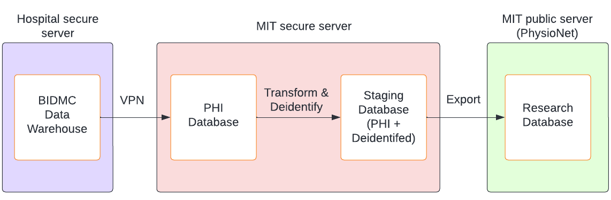
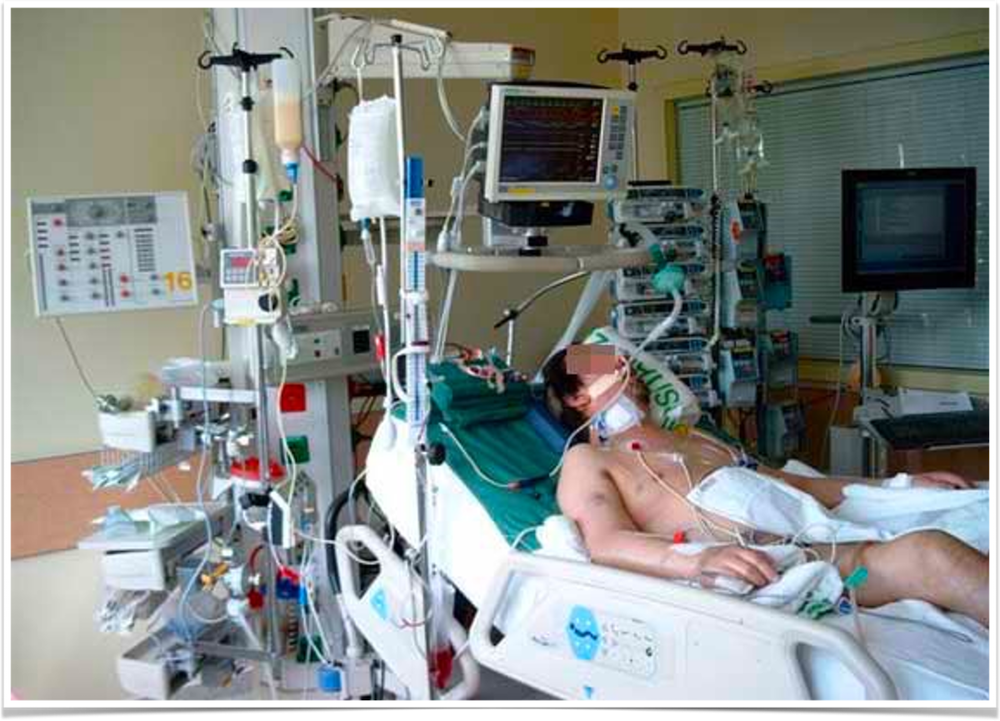

# Clinical Context

## MIMIC-IV

- Publicly accessible critical care database
- \>50,000 ICU stays between 2008-2018
- Modular (structured EHR, X-rays, waveforms, clinical text, echos...)
- Team includes caregivers at Beth Israel

## Reproducible workflow

## Critical care

## Example patient

_Reproduced under [CC BY 4.0](https://creativecommons.org/licenses/by/4.0/) from: Johnson AEW et al. MIMIC-III, a freely accessible critical care database. Sci Data 2016; 3: 160035. https://doi.org/10.1038/sdata.2016.35_
