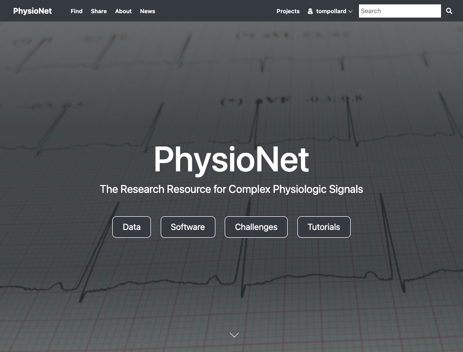
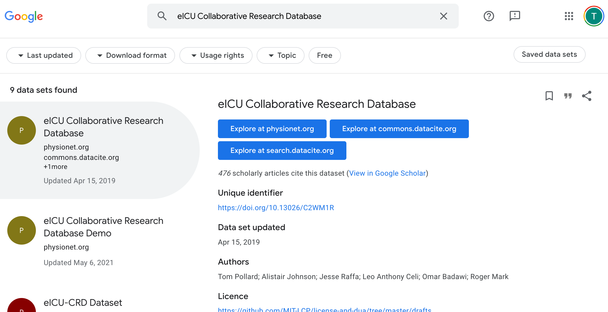
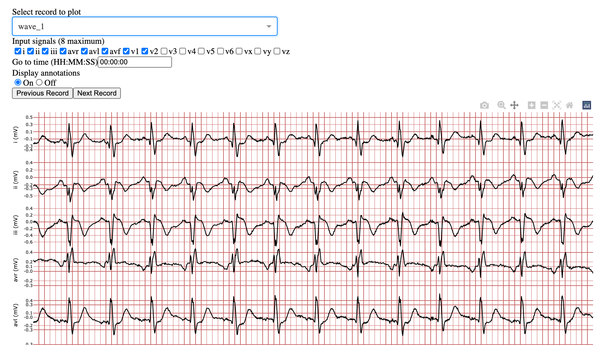
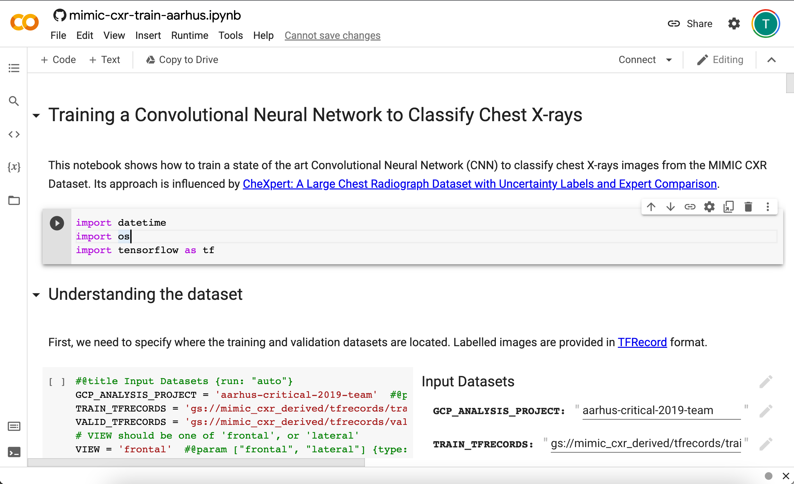

# PhysioNet

## Overview

- [PhysioNet](https://physionet.org/) is a data sharing platform built and maintained by MIT
- Rebuilt from scratch in 2019 following "FAIR principles"
- \>50,000 registered, active users
- Supports data use agreements and training

## Recommended repository for several journals

Springer Nature, eLife, PLOS...

_Source: [Springer Nature](https://www.springernature.com/gp/authors/research-data-policy/repositories-health/12327108)_

## Access control

- **Open data**
- **Restricted**:
  - Data Use Agreement.
- **Credentialed**:
  - Data Use Agreement
  - Training in human research.
  - Identity check.
- **Contributor-managed**:
  - Approval of the contributor.

## Enhanced discovery

Structured metadata is distributed to search indexes.

# Integrated viewers

Data such as waveforms can be viewed directly in the browser.

# Cloud integration

Integrated with cloud, enabling analysis without the need to download files.

## Diverse, active community

Regular workshops, challenges, and datathons based around PhysioNet datasets

